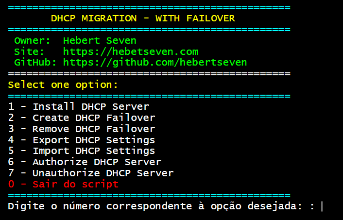

# Migrate-DHCP-With-Failover
Script for DHCP Migration

### How to run:

Just copy or download the .ps1 and run on any computer or server that meets the requirements below.

### Requirements:

The script must be run with the following requirements:

 - Must be run with administrator rights to excecute

### Screenshots:

  
